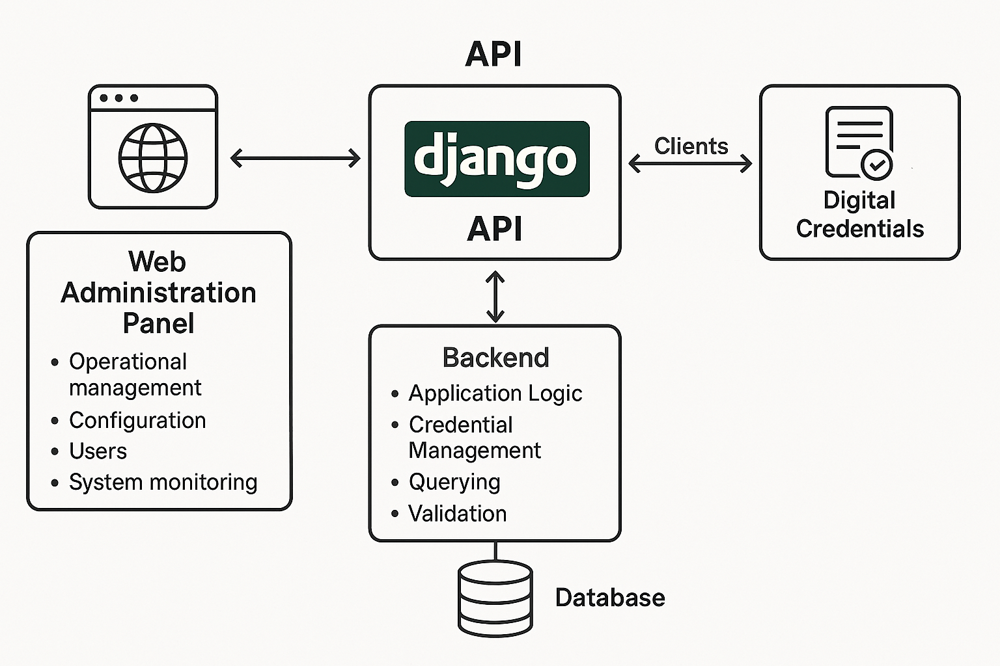
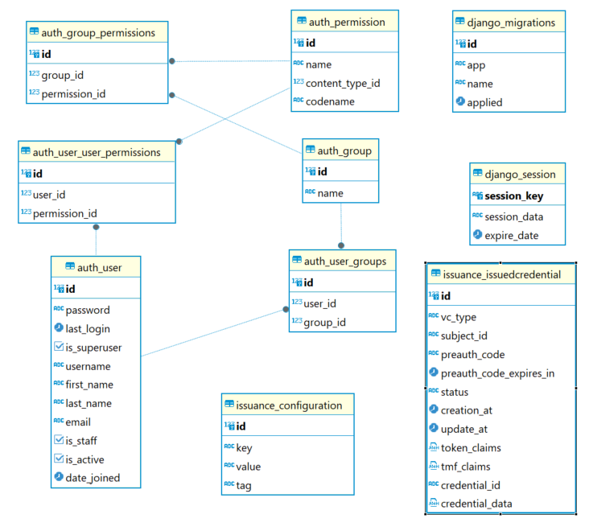

# ISBE-ART-00103 - Emisión de credenciales

## 1. Identificación del Artefacto

| Campo | Valor |
|----------------------------|--------------------------------------------------------------------------------------------------------------------------------------------------------------------------------------------------|
| **Nombre del artefacto**   | ISBE-ART-00103 — Emisión de credenciales |
| **Origen**                 | Catálogo de Servicios ISBE, especificación OpenAPI |
| **Estado**                 | Validado |
| **Versión del documento**  | 1.0.0 |
| **Fecha**                  | 2025-11-24 |
| **Repositorio**            | [https://github.com/alastria/isbe-identity-credentials-issuer](https://github.com/alastria/isbe-identity-credentials-issuer/tree/main) |
| **Commit**                 | 89d882e89296724de26e1aa12bcf331cfbc8bae2 |

## 2. Propósito del Artefacto

- **Objetivo funcional**: Facilitar la emisión segura y eficiente de credenciales digitales de identidad, permitiendo a los usuarios obtener, gestionar y presentar sus credenciales de manera confiable y conforme a los estándares regulatorios.
- **Valor que aporta al proyecto:** Permite a ISBE ofrecer un mecanismo confiable y estandarizado para la emisión de credenciales digitales.
- **Stakeholders clave:** Squads de desarrollo y consumidores del servicio.

## **3. Alcance y Ciclo de Vida**

Abarca la implementación y gestión de un servicio de emisión de credenciales digitales, compuesto por una API RESTful y un panel de administración basado en Django. 

- **Alcance funcional:** 
    - Exposición de una API para la emisión, consulta y gestión de credenciales digitales.
    - Panel de administración web para la gestión operativa, configuración, usuarios y monitoreo del sistema.
- **Fases cubiertas:**
  - ✅ **Definición:** especificación de la API y el diseño del panel de administración.
  - ✅ **Desarrollo:** implementación de los endpoints y lógica de negocio.
- **Entregables:** 
    - Código fuente de la API y del panel de administración.
    - Documentación de la api en formato Swagger/OpenAPI.
    - Scripts de despliegue y configuración.
- **Dependencias:** 
    - Requiere servicios de autenticación (KeyCloak) y base de datos.
- **Mantenimiento:** 
    - Actualizaciones periódicas para incorporar mejoras, corregir errores y cumplir con cambios regulatorios.
    - Soporte para nuevas versiones de Django y librerías asociadas.

## **4. Definición del Artefacto**

### **4.1. Artefacto de arquitectura de referencia:**

    - API Django para emisión, consulta y gestión de credenciales digitales.
    - Panel de administración web para gestión operativa, configuración, usuarios y monitoreo.
    - Backend con lógica de aplicación, manejo de credenciales, consultas y validación.
    - Base de datos conectada al backend.
    - Clientes que interactúan con la API para credenciales digitales.

###  **4.2. Modelos de datos:**

Contine las tablas principales y más importantes, una parte de Django y las propias de este componente.

### **4.3. Reglas de negocio asociadas:**

A continuación se detallan los endpoints principales expuestos por la API, junto con una breve descripción basada en la implementación de cada uno:

| Método | Endpoint                       | Descripción                                                                                   |
|--------|-------------------------------|-----------------------------------------------------------------------------------------------|
| GET    | /health                       | Devuelve el estado de salud del servicio para monitorización y comprobación de disponibilidad. |
| GET    | /metrics                      | Expone métricas internas del sistema para propósitos de observabilidad y monitoreo.            |
| POST   | /issuance/claims              | Retorna los correspoientes claims para la correspodiente solicitud de credencial. |
| POST   | /issuance/employee            | Solicitar credencial para un empleado |
| POST   | /issuance/identifiers         | Devuelve únicamente los vc_types para los que el subject_id tiene permisos. |
| POST   | /issuance/notifications       | Recibe noticiaciones del componente "connector" indicando estados de las credenciales. |
| POST   | /issuance/representative      | Solicitar creción de una credencial de representación para una empresa. |

## **5. Desarrollo del Artefacto**

### **5.1. Componentes del artefacto**

El desarrollo del artefacto incluye los siguientes componentes principales:

- **API RESTful** implementada en Django para la emisión, consulta y gestión de credenciales digitales.
- **Panel de administración web** basado en Django Admin para la gestión operativa, configuración, usuarios y monitoreo.
- **Modelos de datos** definidos en Django ORM para la persistencia de información relevante (usuarios, credenciales, logs, configuraciones).
- **Scripts de despliegue y configuración** (Docker, docker-compose, helm-chart) para facilitar la instalación y puesta en marcha del sistema.
- **Documentación técnica** generada en formato OpenAPI/Swagger y manuales de usuario para el panel de administración.

### **5.2. Lista de elementos clave producidos**

| Nombre                                   | Descripción                                                                                                                                         | Enlace                                                                                  |
|------------------------------------------|-----------------------------------------------------------------------------------------------------------------------------------------------------|-----------------------------------------------------------------------------------------|
| **Código fuente**                        | Implementación de la API y panel de administración	                                          | [Repositorio GitHub](https://github.com/alastria/isbe-identity-credentials-issuer)                                                                     |
| **Documentación API**                    |	Especificación OpenAPI/Swagger de los endpoints | GET al endpoint `/swagger`           |
| **Modelos Django**                       | Modelos de Django.                                               | `issuance/models.py`                                                                    |
| **Implementación de los endpoints principales** | Conjunto de vistas/controladores que gestionan las peticiones HTTP y orquestan la lógica de negocio de la API.                                    | `issuance/views.py`                                                                     |
| **Docker**                               | Ficheros de configuración para la construcción y ejecución de los servicios en contenedores, facilitando entornos reproducibles.                   | `Dockerfile`, `docker-compose.yml`                                                     |
| **Despliegue Kubernetes**               | Recursos y plantillas Helm para el despliegue, configuración y gestión de la aplicación en un clúster de Kubernetes.                               | Carpeta `.helm`                                                                         |
| **Git Workflow**                         | Flujos de CI/CD que automatizan la construcción de la imagen, el push al registro (ECR) y el despliegue en los entornos definidos.                | Carpeta `.github/workflows`             |

### **5.3. Frameworks, librerías o tecnologías acordadas**

- **Backend:** Django 4.x, Django REST Framework
- **Base de datos:** PostgreSQL
- **Autenticación:** KeyCloak (OIDC)
- **Contenerización:** Docker, docker-compose
- **Documentación:** Swagger/OpenAPI
- **Monitorización:** Prometheus (métricas expuestas por la API)

### **5.4. Buenas prácticas aplicables**

- Uso de control de versiones (Git, GitHub)
- Pruebas unitarias y de integración automatizadas
- Cumplimiento de PEP8 y convenciones de código Python
- Auditoría y logging de operaciones sensibles
- Actualización periódica de dependencias

### **5.5. Criterios de validación del desarrollo**

- Revisión de código por pares (pull requests)
- Evidencias de funcionamiento en entorno de staging/testing

### **5.6. Alineación con requisitos legales (GDPR, NIS2, etc.)**

- **RGPD**: Minimización y protección de datos personales.

### **5.7. Dependencias técnicas o de infraestructura**

- Instancia/Servicio de KeyCloak para autenticación y validación de tokens
- Servidor PostgreSQL para persistencia de datos

### 5.8. **Limitaciones temporales**

- No procede por ahora.

### **5.9. Limitaciones por versiones, licencias o configuraciones**

- Compatibilidad garantizada con Django 4.x y PostgreSQL 13+
- Uso de librerías open source bajo licencias compatibles (MIT, Apache 2.0)
- Configuración adaptable mediante variables de entorno y archivos de configuración

## **6. Reglas de Control y Actualización**

- El control de versiones del código fuente se gestiona mediante Git y GitHub.
- Cada cambio relevante debe realizarse a través de pull requests, que requieren revisión y aprobación por parte de otro miembro del equipo antes de ser fusionados a la rama principal.
- Las versiones del artefacto se etiquetan en el repositorio con tags que reflejan el número de versión, seguido de la creación de la release en el repositorio, asociado al tag previo.
- El responsable de la actualización es el equipo de desarrollo asignado al proyecto, bajo la supervisión del responsable técnico.

| Tipo de cambio      | Versionado | Flujo de aprobación                | Documentación requerida         |
|--------------------|------------|------------------------------------|---------------------------------|
| Evolutivo menor    | X.Y+0.1    | Pull Request + revisión GT         | Release notes detalladas        |
| Evolutivo mayor    | X+1.0      | Pull Request + revisión Comité     | Informe de impacto y release notes |
| Correctivo         | X.Y.Z+1    | Pull Request + revisión GT         | Descripción del fix en release notes |
