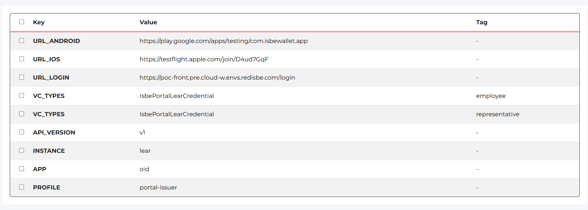

# Configuración de claves utilizadas en la tabla 'configuration'.

 Estas claves permiten gestionar y personalizar el comportamiento de la aplicación a través de la tabla de configuración.

- CONFIG_KEY_VC_TYPES: Define los tipos de VC (credenciales verificables) soportados por la aplicación.
- CONFIG_KEY_PROFILE: Indica el perfil de configuración activo o predeterminado (debe de existir en Conector Identfy)
- CONFIG_KEY_APP: Especifica el nombre o identificador de la aplicación. 
- CONFIG_KEY_INSTANCE: Identifica la instancia específica de la aplicación o servicio (debe de existir en Conector Identfy)
- CONFIG_KEY_API_VERSION: Determina la versión de la API que se está utilizando (debe concordar conConector Identfy)
- CONFIG_URL_IOS: URL de descarga o acceso para la aplicación en dispositivos iOS.
- CONFIG_URL_ANDROID: URL de descarga o acceso para la aplicación en dispositivos Android.
- CONFIG_URL_LOGIN: URL utilizada para el inicio de sesión de usuarios.

 Valores actuales configurados para DEV, para PRE y PRO sólo cambia CONFIG_URL_LOGIN.

 

# Variables de entorno y secretos

Variables de configuración y secretos para el despliegue del servicio de emisión de credenciales de identidad.

Variables:
- ALLOWED_HOSTS: Lista de hosts permitidos para acceder a la aplicación. Usar '*' permite cualquier host.
- BACKEND_DOMAIN: Dominio principal del backend de la aplicación.
- CORS_ALLOWED_ORIGINS: Orígenes permitidos para solicitudes CORS, separados por comas.
- CSRF_TRUSTED_ORIGINS: Orígenes confiables para protección CSRF.
- DEFAULT_FROM_EMAIL: Dirección de correo utilizada como remitente por defecto en los envíos de email.
- EMAIL_HOST: Servidor SMTP utilizado para el envío de correos electrónicos.
- EMAIL_HOST_USER: Usuario para autenticación en el servidor SMTP.
- EMAIL_PORT: Puerto utilizado para la conexión SMTP.
- EMAIL_USE_SSL: Indica si se debe usar SSL para la conexión SMTP.
- EMAIL_USE_TLS: Indica si se debe usar TLS para la conexión SMTP.
- IDENTFY_CONNECTOR_API_URL: URL interna del conector Identfy para integración de servicios de identidad.
- KEYCLOAK_JWKS_URI: URI para obtener las claves públicas JWKS de Keycloak para validación de tokens.
- MANAGEMENT_API_URL: URL interna de la API de gestión del middleware.
- TMF_API_URL: URL externa de la API TMF para gestión de partes interesadas.

Secretos (almacenados bajo el nombre isbe-identity-credentials-issuer):
- DATABASE_URL: Cadena de conexión a la base de datos.
- EMAIL_HOST_PASSWORD: Contraseña para el usuario de correo electrónico.
- IDENTFY_CONNECTOR_API_KEY: API Key para autenticación con el conector Identfy.
- SECRET_KEY: Clave secreta utilizada por la aplicación para operaciones criptográficas y de seguridad.

## Ejemplo de configuración para PRO

- Variables:
    - ALLOWED_HOSTS: *
    - BACKEND_DOMAIN: https://identity-credentials-issuer.pro.cloud-w.envs.redisbe.com
    - CORS_ALLOWED_ORIGINS: https://identity-credentials-issuer.pro.cloud-w.envs.redisbe.com,https://poc-front.pro.cloud-w.envs.redisbe.com
    - CSRF_TRUSTED_ORIGINS: https://identity-credentials-issuer.pro.cloud-w.envs.redisbe.com
    - DEFAULT_FROM_EMAIL: no-reply@redisbe.com
    - EMAIL_HOST: smtp.serviciodecorreo.es
    - EMAIL_HOST_USER: no-reply@redisbe.com
    - EMAIL_PORT: 465
    - EMAIL_USE_SSL: true
    - EMAIL_USE_TLS: false
    - IDENTFY_CONNECTOR_API_URL: http://izertis-identfy-connector.portal-apps.svc.cluster.local:3000
    - KEYCLOAK_JWKS_URI: http://keycloakx-http.keycloak-idp.svc.cluster.local/auth/realms/pro-isbe/protocol/openid-connect/certs
    - MANAGEMENT_API_URL: http://isbe-poc-middleware-management.portal-apps.svc.cluster.local:3000/api
    - TMF_API_URL: https://tmf.evidenceledger.eu/tmf-api/party/v4

- Secrets
    - DATABASE_URL: XXXX
    - EMAIL_HOST_PASSWORD: XXXX
    - IDENTFY_CONNECTOR_API_KEY: XXXX
    - SECRET_KEY: XXXXX